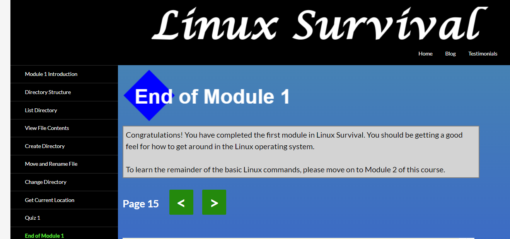

# kottans-frontend

Hi! I'm Natata, and I'm going to accomplish this self-studying course. 
Thanks to all creators and supporters of this community!!!

## Tasks

-   [x] [Git Basics](#git-basics)
-   [x] [Linux CLI, and HTTP](#linux-cli-and-http)
-   [ ] [Git Collaboration](#git-collaboration)
-   [ ] [Intro to HTML and CSS](#intro-to-html-and-css)
-   [ ] [Responsive Web Design](#responsive-web-design)
-   [ ] [HTML CSS Popup](#html-css-popup)
-   [ ] [JS Basics](#js-basics)
-   [ ] [DOM](#dom)
-   [ ] [Tiny JS World](#tiny-js-world)
-   [ ] [Object Oriented JS](#object-oriented-js)
-   [ ] [OOP Exercise](#oop-exercise)
-   [ ] [Offline Web Applications](#offline-web-applications)
-   [ ] [Memory Pair Game](#memory-pair-game)
-   [ ] [Website Performance Optimization](#website-performance-optimization)
-   [ ] [Friends App](#friends-app)

## Git Basics

I discovered that 'support for password authentication was removed' on August 13, 2021, so I couldn't clone a repository from GitHub. I had to update Git up to the last version. Logged in with the Git Credential Manager
[The list of Git commands is here](git-commands.txt)

## Linux CLI, and HTTP

> 

>   
Linux Survival Screenshots

>    

>    

>    

>  

[The list of Linux commands is here](linux-commands.txt)